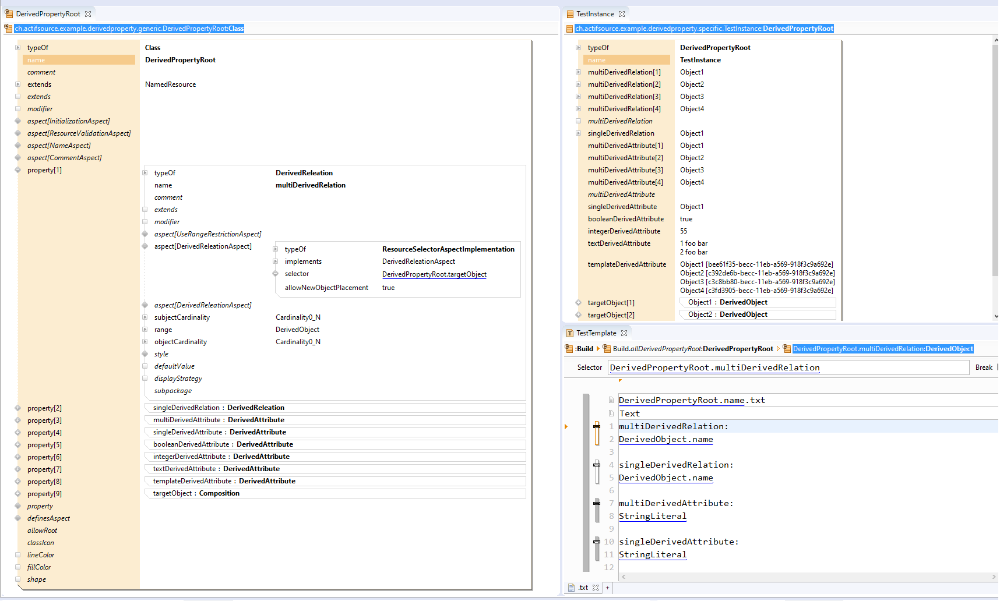
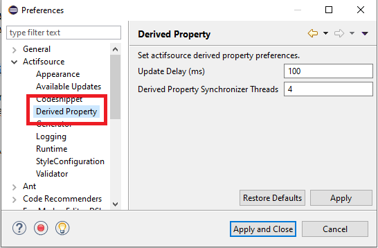

# Derived Property (Derived Relation and Derived Attribute)
In this project we will show how to define a derived relation or a derived attribute.

## DerivedReleation
A DerivedReleation is a loose Relation between source and target and cannot be edited.
The targets are defined by DerivedReleationAspect.

## DerivedAttribute
An DerivedAttribute is a simple value-typed property of a class and cannot be edited.
The values are defined by DerivedAttributeAspect.

## Derived Property Preferences

## Requirements
Actifsource Workbench Community Edition

## License
[http://www.actifsource.com/company/license](http://www.actifsource.com/company/license)

